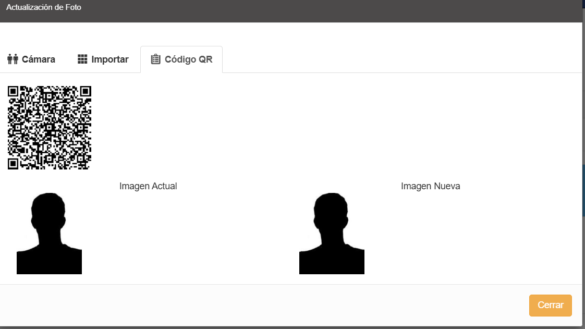
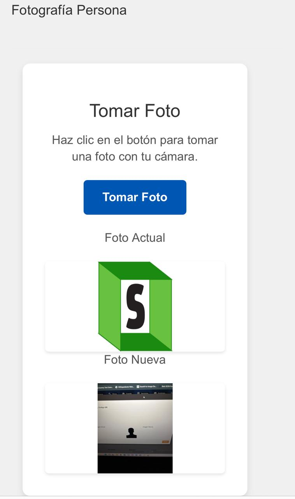
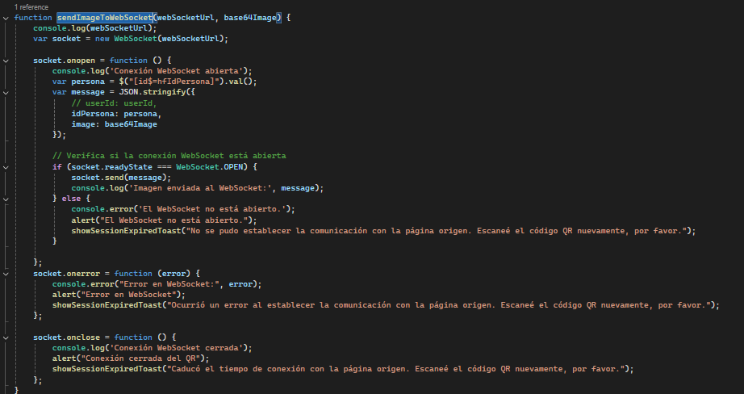

## Descripción del Proyecto WebSocketQRCredex

Este módulo implementa un servidor WebSocket utilizando Node.js, Express y la biblioteca ws. Su propósito principal es recibir imágenes en formato Base64 desde clientes conectados y retransmitirlas en tiempo real a los demás clientes conectados, identificando cada imagen con un campo idPersona.

## Funcionalidades principales

1. Servidor HTTP y WebSocket integrado: Se levanta un servidor Express y se enlaza con un servidor WebSocket para permitir comunicaciones bidireccionales en tiempo real.

2. Control de acceso (CORS): Se configura el middleware CORS para permitir solicitudes solo desde una URL frontend específica, aceptando métodos GET y POST, y cabeceras personalizadas.

3. Endpoint /healtcheck: Ruta simple de verificación para confirmar que el servidor está activo.

4. Conexión de clientes WebSocket:
    - Al recibir un mensaje, intenta parsearlo como JSON.
    - Verifica que el mensaje contenga idPersona e image (imagen en Base64).
    - Si el mensaje es válido, reenvía la imagen a todos los demás clientes conectados.

5. Manejo de eventos:
    - connection: Nuevo cliente conectado.
    - message: Procesamiento de imagen recibida.
    - close: Cliente desconectado.
    - error: Registro de errores en la conexión WebSocket.

## Paquetes Utilizados

 -  **cors**: Middleware de Express que permite configurar políticas de CORS (Cross-Origin Resource Sharing), controlando qué orígenes pueden hacer peticiones al servidor. Muy útil cuando el frontend y backend están en dominios distintos.

 - **dotenv**: Permite cargar variables de entorno desde un archivo `.env` al entorno de ejecución de Node.js, útil para manejar configuraciones como puertos o claves sin exponerlas directamente en el código.

 - **express** | Framework minimalista para Node.js que facilita la creación de servidores HTTP y APIs. Se usa aquí para definir rutas y middleware, como CORS y `/
 healtcheck`. 

 - **ws**: Biblioteca que permite implementar servidores y clientes WebSocket en Node.js, facilitando la comunicación en tiempo real entre el servidor y múltiples clientes. Es la base del sistema de envío/recepción de imágenes en tu aplicación.

 ## Imágenes de Ejemplo para lo que se utilizo este proyecto
A continuación, se detallan algunas imágenes representativas del funcionamiento de la aplicación:

1. QR para escanear con el móvil:
En esta imagen se muestra el QR que los usuarios pueden escanear con sus dispositivos móviles para tomar una foto. Este QR es parte de la interfaz de usuario que permite a los clientes enviar imágenes al servidor WebSocket en tiempo real.

2. Interfaz del proyecto en un dispositivo móvil:
A continuación, se muestra cómo se visualiza la página web desde un dispositivo móvil. Esta vista permite a los usuarios tomar fotos y enviarlas al servidor WebSocket, que luego las retransmite a otros clientes conectados en tiempo real.

3. Código de WebSocket en acción:
Esta imagen presenta el fragmento de código que maneja la funcionalidad de WebSocket. Este código es el encargado de recibir y transmitir imágenes entre los clientes conectados, asegurando que se realice en tiempo real con la mayor eficiencia posible.

 ## Comnado para usar el proyecto:

 - npm install

 - npm start

 ## Despliegue con Docker

 ### 📦 Requisitos
1. Docker instalado

2. Docker Compose (opcional pero recomendado)

3. Archivo .env con las variables necesarias, incluyendo WEBSOCKET_PORT

### 📁 Estructura de Archivos
- Dockerfile: Define la imagen personalizada

- docker-compose.yml: Orquesta el contenedor y sus configuraciones

- .env: Define variables como el puerto del WebSocket (WEBSOCKET_PORT=8080 por ejemplo)

### Para construir la imagen manualmente:
docker build -t websocket-app .

docker compose up -d
